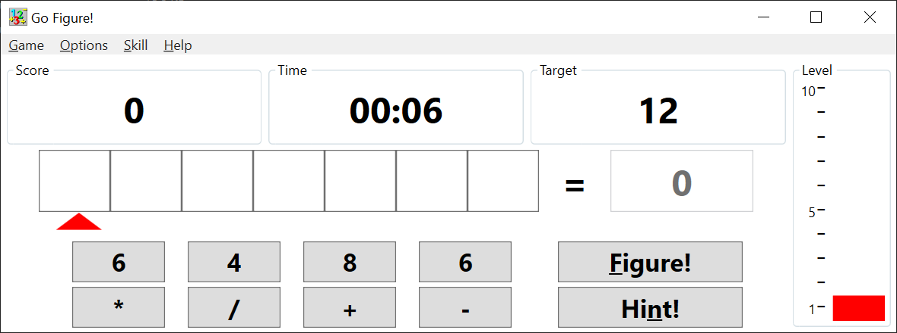

# Go Figure!

Microsoft Entertainment Pack 4, released in 1994, included a game entitled `Go Figure!`. This simple math game is so fun to play I decided to make a modern clone.

Download latest `zip` release [here](https://github.com/djfdyuruiry/go-figure/releases/download/v0.05/go-figure-v0.05.zip)

## What?

I have recreated the following features:

- Random problem generator
- Multiple skill levels
- Hint system
- Game timer
- Level display gauge
- Left-to-Right precendence calculation
- Operator precendence calculation

In the future I wish to add:

- Scoring
- Timeout / Game Over
- Difficulity increase between levels
- A `modern` mode - adding more operators, negative numbers, floating points etc.

## How?

This is a Windows desktop app written using C#, .NET 4.8 and WPF. 

